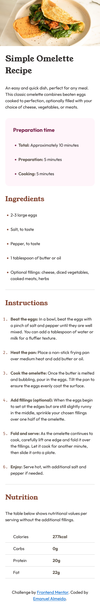

# Frontend Mentor - Recipe page solution

This is a solution to the [Recipe page challenge on Frontend Mentor](https://www.frontendmentor.io/challenges/recipe-page-KiTsR8QQKm). Frontend Mentor challenges help you improve your coding skills by building realistic projects. 

## Table of contents

- [Overview](#overview)
  - [Screenshot](#screenshot)
  - [Links](#links)
- [My process](#my-process)
  - [Built with](#built-with)
  - [What I learned](#what-i-learned)
- [Author](#author)

## Overview

### Screenshot


---------------------------------------------------


---------------------------------------------------



### Links

- Solution URL: [Add solution URL here](https://your-solution-url.com)
- Live Site URL: [https://recipepage-rouge.vercel.app/](https://recipepage-rouge.vercel.app/)

## My process

### Built with

- Basic HTML and CSS

### What I learned

One thing I learned with this project, which gave me a bit of a headache at first, was how to change the color of bullets in an unordered list and the color and font of numbers in an ordered list. I had no idea this was even possible. But I figured it out, it was really cool and a great way to practice. Here you can see the code:

```css
.ingredients ul li::marker {
  color: var(--nutmeg);
}

.instructions ol li::marker {
  color: var(--nutmeg);
  font-family: sans-serif;
}
```

## Author

- Frontend Mentor - [@EmanuelAlmeida27](https://www.frontendmentor.io/profile/EmanuelAlmeida27)
